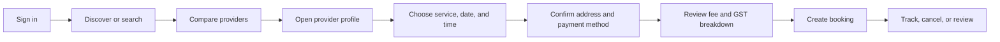
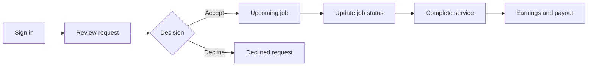

# Shop2Door

### Local help, thoughtfully matched.

Shop2Door is a two-sided local-services marketplace prototype for discovering, booking, and managing trusted professionals. Customers can find nearby providers and book services, partners can manage their business operations, and administrators can oversee marketplace activity from one platform.

> **Current status:** Working prototype with an Express API, responsive browser UI, Azure SQL support, and an in-memory seed-data fallback for local demonstrations.

## Product At A Glance

| Workspace | What it provides |
| --- | --- |
| **Customer** | Discover categories, search providers, compare ratings and prices, book services, track bookings, manage wallet and rewards, leave reviews, and contact support |
| **Partner** | Review booking requests, manage services, update availability, view jobs and earnings, maintain a business profile, and monitor verification status |
| **Admin** | View marketplace metrics, customers, providers, bookings, wallet activity, support queries, complaints, loyalty data, insights, exports, and audit records |

## Highlights

- Guided customer booking flow with service, date, time, address, payment method, fee, and GST breakdown.
- Provider discovery with text search, distance, price, rating, and availability filters.
- Provider profiles with services, ratings, reviews, verification signals, service areas, and available slots.
- Partner operations workspace for requests, jobs, services, availability, profiles, earnings, and verification.
- Admin operations workspace for marketplace oversight, support, complaints, reporting, and audit visibility.
- Responsive layouts for desktop and mobile browsers.
- Single-origin Express serving both the frontend and JSON API.
- Azure SQL persistence with a development-friendly seed-mode fallback.

## Screenshots And Demo

The application is designed to be run locally. Start the backend, then open the HTTP URL printed in the terminal. Do not open `index.html` directly with a `file://` URL because browser security policies do not allow the frontend to make same-origin API requests from that origin.

```text
http://localhost:3000/
```

The server automatically tries the next available port if the configured port is already in use. Always use the URL printed by the server.

## Requirements

- Node.js 18 or newer recommended
- npm
- A modern browser: Chrome, Safari, Edge, or Firefox
- Azure SQL is optional for local development; the application uses seed data when Azure SQL configuration is absent

## Quick Start

### 1. Clone the repository

```bash
git clone https://github.com/harshmishra21/Shop2Door.git
cd Shop2Door
```

### 2. Install backend dependencies

```bash
cd server
npm install
```

### 3. Start Shop2Door

```bash
npm start
```

You should see a message similar to:

```text
[server] Shop2Door backend on http://localhost:3000 (db: seed)
```

### 4. Open the application

Open the printed HTTP address in your browser. The API and frontend are served from the same origin, so no separate frontend server or CORS configuration is required for the standard local setup.

## Demo Accounts

The prototype includes development-only demo accounts with autofill support on the login screen.

| Role | Email | Password |
| --- | --- | --- |
| Customer | `demouser@mail.com` | `demo1234` |
| Partner | `demopart@mail.com` | `demo1234` |
| Admin | `demoadmin@mail.com` | `demo1234` |

These credentials and seed records must be removed, rotated, or disabled before production deployment.

## Project Structure

```text
Shop2Door/
├── index.html              # Application shell and workspace containers
├── app.js                  # API client, authentication, routing, and rendered views
├── script.js               # Legacy/static interaction helpers
├── styles.css              # Responsive UI styling
├── SRS.md                  # Detailed software requirements specification
└── server/
    ├── package.json        # Backend scripts and dependencies
    ├── schema.sql          # Azure SQL schema
    ├── seed.js             # Development/demo data
    └── src/
        ├── index.js        # Express server and static frontend hosting
        ├── auth.js         # Password/session primitives
        ├── db.js           # Azure SQL connection with seed fallback
        ├── store.js        # Data-access and business operations
        └── routes/         # Auth, customer, partner, and admin APIs
```

## Configuration

Without database variables, the server runs in seed mode:

```text
[db] No Azure SQL config — running in SEED mode
```

To connect to Azure SQL, configure these environment variables before starting the server:

```bash
export AZURE_SQL_USER="your-user"
export AZURE_SQL_PASSWORD="your-password"
export AZURE_SQL_SERVER="your-server.database.windows.net"
export AZURE_SQL_DATABASE="shop2door"
export PORT=3000
npm start
```

Never commit credentials or `.env` files containing secrets. In a team or hosted environment, use the platform's secret manager instead of shell history or source control.

### Database setup

1. Create an Azure SQL database.
2. Run [`server/schema.sql`](server/schema.sql) against the database.
3. Load approved initial catalog and operational data using the project seed process or an environment-specific migration.
4. Start the server with the Azure SQL variables configured.
5. Confirm the health endpoint reports `azure`:

```bash
curl http://localhost:3000/api/health
```

Example response shape:

```json
{
  "status": "ok",
  "db": "azure",
  "time": "2026-09-12T00:00:00.000Z"
}
```

## API Overview

All API routes are mounted below `/api` and return JSON.

### Health and authentication

```text
GET  /api/health
POST /api/auth/login
POST /api/auth/register
GET  /api/auth/me
POST /api/auth/logout
```

### Customer

```text
GET  /api/categories
GET  /api/providers
GET  /api/providers/:id
GET  /api/recommendations
GET  /api/bookings?tab=upcoming|active|completed|cancelled
POST /api/bookings
GET  /api/bookings/:id
POST /api/bookings/:id/cancel
GET  /api/wallet
POST /api/wallet/topup
GET  /api/loyalty
POST /api/loyalty/redeem
POST /api/reviews
GET  /api/tickets
POST /api/tickets
GET  /api/counts
```

### Partner

```text
GET   /api/partner/dashboard
GET   /api/partner/requests?tab=new|upcoming|active|completed
GET   /api/partner/jobs/:id
POST  /api/partner/jobs/:id/accept
POST  /api/partner/jobs/:id/decline
POST  /api/partner/jobs/:id/status
GET   /api/partner/services
POST  /api/partner/services
PATCH /api/partner/services/:id
GET   /api/partner/availability
PATCH /api/partner/availability
GET   /api/partner/earnings
GET   /api/partner/profile
PATCH /api/partner/profile
GET   /api/partner/counts
```

### Admin

```text
GET   /api/admin/overview
GET   /api/admin/customers
GET   /api/admin/providers
GET   /api/admin/bookings
GET   /api/admin/wallet
GET   /api/admin/audit
GET   /api/admin/loyalty
GET   /api/admin/insights
GET   /api/admin/exports
POST  /api/admin/exports
GET   /api/admin/queries
POST  /api/admin/queries/:id/reply
GET   /api/admin/complaints
PATCH /api/admin/complaints/:id
GET   /api/admin/counts
```

Protected endpoints require the authenticated session credential. Authorization is enforced on the server by role and, for customer/partner resources, by resource ownership.

## Core User Flows

### Customer booking



### Partner fulfillment



### Booking states

The current baseline represents these booking states:

```text
pending -> confirmed -> in_progress -> completed
    └───────────────> cancelled
    └───────────────> declined
```

The final production state machine, cancellation policy, payment authorization timing, refund rules, and notification behavior require product approval.

## Development Checks

Run these checks from the repository root:

```bash
node --check app.js
node --check server/src/index.js
node --check server/src/store.js
```

Check the running service:

```bash
curl http://localhost:3000/api/health
```

The repository currently has no automated test script configured. Production delivery should add unit, API integration, end-to-end, accessibility, security, and performance tests as described in [`SRS.md`](SRS.md).

## Architecture Notes

- **Frontend:** Static HTML, CSS, and browser JavaScript.
- **Backend:** Node.js and Express.
- **Persistence:** Azure SQL through the `mssql` driver.
- **Development fallback:** In-memory copy of `seed.js` when Azure SQL is unavailable.
- **Authentication baseline:** Opaque in-memory bearer sessions and salted password hashing for the prototype.
- **Serving model:** Express serves `/api` and the frontend from one origin.

The fallback is intentionally useful for demos but must not silently replace production persistence during an outage. See the production-readiness section below and the SRS for the complete requirements baseline.

## Production Readiness

This repository is a strong functional prototype, not a finished production marketplace. Before launch, the following areas require completion or hardening:

- Replace prototype SHA-256 password hashing with Argon2id, scrypt, or bcrypt.
- Replace in-memory sessions with secure, expiring, revocable production sessions.
- Add request schemas, stable error codes, pagination, API versioning, and OpenAPI documentation.
- Add database migrations, foreign keys, transactions, concurrency controls, canonical timestamps, and reconciliation.
- Integrate and verify payment, refund, payout, notification, and webhook workflows.
- Enforce booking availability, cancellation, service-area, tax, and refund policies server-side.
- Add least-privilege admin permissions and comprehensive audit coverage.
- Add monitoring, alerting, backups, restore testing, incident runbooks, and deployment rollback procedures.
- Remove demo credentials and seed data from production builds.
- Add automated security, accessibility, compatibility, performance, and end-to-end coverage.

The authoritative detailed requirements, acceptance criteria, open decisions, and implementation gaps are documented in [`SRS.md`](SRS.md).

## Contributing

1. Create a focused branch for your change.
2. Keep frontend, API, database, and SRS behavior aligned.
3. Avoid committing credentials, generated secrets, or local database artifacts.
4. Run the available syntax and health checks before opening a pull request.
5. Include tests or explain the remaining coverage gap for behavior changes.
6. Update [`SRS.md`](SRS.md) when a requirement, API contract, data model, or production assumption changes.

## License

No license has been declared for this repository yet. Do not redistribute or reuse the code until the project owner adds an explicit license.
